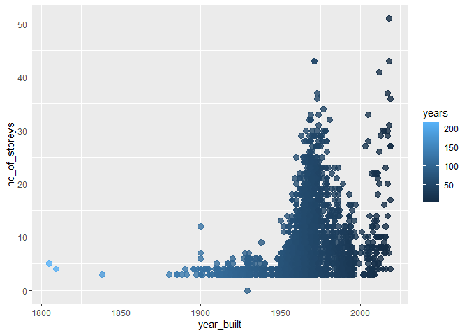
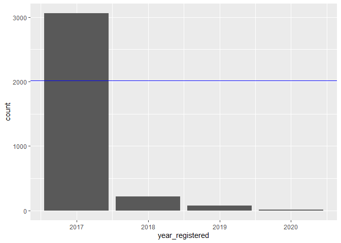
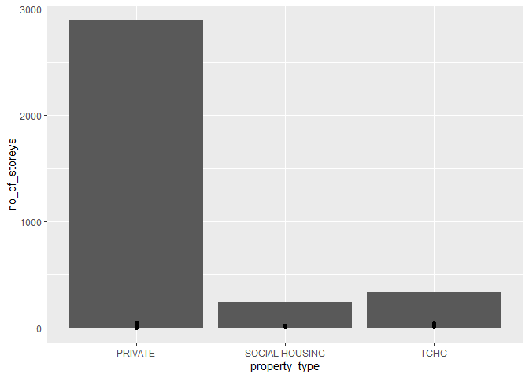

Mini Data Analysis Milestone 2
================
Elizabeth Zambrano
13/10/2021

# Welcome back to your mini data analysis project!

This time, we will explore more in depth the concept of *tidy data*, and
hopefully investigate further into your research questions that you
defined in milestone 1.

**NOTE**: The main purpose of the mini data analysis is to integrate
what you learn in class in an analysis. Although each milestone provides
a framework for you to conduct your analysis, it’s possible that you
might find the instructions too rigid for your data set. If this is the
case, you may deviate from the instructions – just make sure you’re
demonstrating a wide range of tools and techniques taught in this class.

Begin by loading your data and the tidyverse package below: \#Packages
used:

``` r
library(datateachr) 
library(tidyverse)
library(dplyr)
library(tidyr)
library(ggplot2)
```

# Learning Objectives

By the end of this milestone, you should:

-   Become familiar with manipulating and summarizing your data in
    tibbles using `dplyr` and `tidyr`, with a research question in mind.
-   Understand what *tidy* data is, and how to create it. In milestone
    3, we will explore when this might be useful.
-   Generate a reproducible and clear report using R Markdown.
-   Gain a greater understanding of how to use R to answer research
    questions about your data.

**Things to keep in mind**

-   Remember to document your code, be explicit about what you are
    doing, and write notes in this markdown document when you feel that
    context is required. Create your analysis as if someone else will be
    reading it! **There will be 2.5 points reserved for reproducibility,
    readability, and repo organization.**

-   Before working on each task, you should always keep in mind the
    specific **research question** that you’re trying to answer.

# Task 1: Process and summarize your data (15 points)

From milestone 1, you should have an idea of the basic structure of your
dataset (e.g. number of rows and columns, class types, etc.). Here, we
will start investigating your data more in-depth using various data
manipulation functions.

### 1.1 (2.5 points)

First, write out the 4 research questions you defined in milestone 1
were. This will guide your work through milestone 2: 1. Do newer
buildings have more amenities? 2. What is the average number of years to
get registered after the building is built? 3. Is there a positive
relationship between non-smoking buildings and year it was built
(i.e. newer buildings do not allow smoking in the building but older
ones do?) 4. Analyze the relationship between number of units and number
of storeys

Data used:

``` r
head(apt_buildings)
```

    ## # A tibble: 6 x 37
    ##      id air_conditioning amenities   balconies barrier_free_acc~ bike_parking   
    ##   <dbl> <chr>            <chr>       <chr>     <chr>             <chr>          
    ## 1 10359 NONE             Outdoor re~ YES       YES               0 indoor parki~
    ## 2 10360 NONE             Outdoor po~ YES       NO                0 indoor parki~
    ## 3 10361 NONE             <NA>        YES       NO                Not Available  
    ## 4 10362 NONE             <NA>        YES       YES               Not Available  
    ## 5 10363 NONE             <NA>        NO        NO                12 indoor park~
    ## 6 10364 NONE             <NA>        NO        NO                Not Available  
    ## # ... with 31 more variables: exterior_fire_escape <chr>, fire_alarm <chr>,
    ## #   garbage_chutes <chr>, heating_type <chr>, intercom <chr>,
    ## #   laundry_room <chr>, locker_or_storage_room <chr>, no_of_elevators <dbl>,
    ## #   parking_type <chr>, pets_allowed <chr>, prop_management_company_name <chr>,
    ## #   property_type <chr>, rsn <dbl>, separate_gas_meters <chr>,
    ## #   separate_hydro_meters <chr>, separate_water_meters <chr>,
    ## #   site_address <chr>, sprinkler_system <chr>, visitor_parking <chr>, ...

``` r
colnames(apt_buildings)
```

    ##  [1] "id"                               "air_conditioning"                
    ##  [3] "amenities"                        "balconies"                       
    ##  [5] "barrier_free_accessibilty_entr"   "bike_parking"                    
    ##  [7] "exterior_fire_escape"             "fire_alarm"                      
    ##  [9] "garbage_chutes"                   "heating_type"                    
    ## [11] "intercom"                         "laundry_room"                    
    ## [13] "locker_or_storage_room"           "no_of_elevators"                 
    ## [15] "parking_type"                     "pets_allowed"                    
    ## [17] "prop_management_company_name"     "property_type"                   
    ## [19] "rsn"                              "separate_gas_meters"             
    ## [21] "separate_hydro_meters"            "separate_water_meters"           
    ## [23] "site_address"                     "sprinkler_system"                
    ## [25] "visitor_parking"                  "ward"                            
    ## [27] "window_type"                      "year_built"                      
    ## [29] "year_registered"                  "no_of_storeys"                   
    ## [31] "emergency_power"                  "non-smoking_building"            
    ## [33] "no_of_units"                      "no_of_accessible_parking_spaces" 
    ## [35] "facilities_available"             "cooling_room"                    
    ## [37] "no_barrier_free_accessible_units"

### 1.2 (10 points)

Now, for each of your four research questions, choose one task from
options 1-4 (summarizing), and one other task from 4-8 (graphing). You
should have 2 tasks done for each research question (8 total). Make sure
it makes sense to do them! (e.g. don’t use a numerical variables for a
task that needs a categorical variable.). Comment on why each task helps
(or doesn’t!) answer the corresponding research question.

Ensure that the output of each operation is printed!

**Summarizing:**

1.  Compute the *range*, *mean*, and *two other summary statistics* of
    **one numerical variable** across the groups of **one categorical
    variable** from your data.
2.  Compute the number of observations for at least one of your
    categorical variables. Do not use the function `table()`!
3.  Create a categorical variable with 3 or more groups from an existing
    numerical variable. You can use this new variable in the other
    tasks! *An example: age in years into “child, teen, adult, senior”.*
4.  Based on two categorical variables, calculate two summary statistics
    of your choosing.

**Graphing:**

5.  Create a graph out of summarized variables that has at least two
    geom layers.
6.  Create a graph of your choosing, make one of the axes logarithmic,
    and format the axes labels so that they are “pretty” or easier to
    read.
7.  Make a graph where it makes sense to customize the alpha
    transparency.
8.  Create 3 histograms out of summarized variables, with each histogram
    having different sized bins. Pick the “best” one and explain why it
    is the best.

Make sure it’s clear what research question you are doing each operation
for!

\#Research question 1 Summarizing task 2:Compute the number of
observations for at least one of your categorical variable

``` r
glimpse(apt_buildings$amenities)
```

    ##  chr [1:3455] "Outdoor rec facilities" "Outdoor pool" NA NA NA NA NA ...

There are 3455 observations, this doesn’t really help answer the
research question. The variable needs to be recoded to tell apart the
amenities

Graphing task 6: create a graph with logarithmic axis (1800, 1850, 1800,
1950)

``` r
apt_buildings <- apt_buildings %>% mutate(years = 2021 - year_built)

plot1 <- ggplot(apt_buildings, aes(year_built, no_of_storeys)) +
 geom_point(aes(color = years),
            size =3,
            alpha = .8) 
plot1
```

    ## Warning: Removed 13 rows containing missing values (geom_point).

<!-- --> Here we
see a graph where the lighter the dot (also the ones on the left are
oldest, given the x axis), the older the building. We can see that
taller buildings are built later on. This helps us understand our data
but doesn’t answer the question, again the amenities variable needs to
be tidy’d to really analyze it!

\#Research question 2 Summarizing task 1: Compute the *range*, *mean*,
and *two other summary statistics* of **one numerical variable** across
the groups of **one categorical variable** from your data

``` r
sum2 <- apt_buildings %>% 
        group_by(pets_allowed) %>%
        summarise(reg_mean = mean(year_registered, na.rm=TRUE), reg_min = min(year_registered, na.rm=TRUE), reg_max= max(year_registered, na.rm=TRUE), reg_median = median(year_registered, na.rm=TRUE))

sum2
```

    ## # A tibble: 3 x 5
    ##   pets_allowed reg_mean reg_min reg_max reg_median
    ##   <chr>           <dbl>   <dbl>   <dbl>      <dbl>
    ## 1 NO              2017.    2017    2019       2017
    ## 2 YES             2017.    2017    2020       2017
    ## 3 <NA>            2018     2017    2019       2018

Here I grouped them by whether having a pet is allowed, doesn’t answer
the research question but it’s interesting- well now we know that
buildings were registered between 2017 and 2020!

Graph task 8 : 2 geoms

``` r
plot2 <- apt_buildings %>% ggplot(aes(year_registered)) +geom_bar() + geom_hline(yintercept = mean(apt_buildings$year_registered, na.rm=TRUE), color="blue")
plot2
```

    ## Warning: Removed 89 rows containing non-finite values (stat_count).

<!-- --> added
bar graphs and a line for the mean, not super useful for the research
question…

\#Research question 3 Summarize task 1:

``` r
sum3<- apt_buildings %>% 
        group_by(`non-smoking_building`) %>%
        summarise(nsb_mean = mean(year_built, na.rm=TRUE), nsb_min = min(year_built, na.rm=TRUE), nsb_max= max(year_built, na.rm=TRUE), nsb_sd = sd(year_built, na.rm=TRUE))
sum3
```

    ## # A tibble: 3 x 5
    ##   `non-smoking_building` nsb_mean nsb_min nsb_max nsb_sd
    ##   <chr>                     <dbl>   <dbl>   <dbl>  <dbl>
    ## 1 NO                        1962.    1809    2018   18.5
    ## 2 YES                       1962.    1805    2019   19.8
    ## 3 <NA>                      1951.    1902    2019   19.6

Now we know that the last year buildings were built was 2019, the
average years between non-smoking buildings and smoking buildings
doesn’t really differ, with very little variability (sd)! So the
positive relationship I expect from the research question might not be
there

Graph task 6:

``` r
buildings <- apt_buildings %>% group_by(year_built) %>%
        summarise(building = n())
#made a new data set to have x and y values
                    
plot3 <- buildings %>% ggplot(aes(year_built, building)) + geom_line() + scale_x_log10("year_built") + ylab("Buildings Built")
plot3
```

    ## Warning: Removed 1 row(s) containing missing values (geom_path).

<!-- -->

\#Research question 4 summarize task 1:

``` r
sum4<- apt_buildings %>% 
        group_by(property_type) %>%
        summarise(nu_mean = mean(no_of_units, na.rm=TRUE), nu_min = min(no_of_units, na.rm=TRUE), nu_max= max(no_of_units, na.rm=TRUE), nu_sd = sd(no_of_units, na.rm=TRUE))
sum4
```

    ## # A tibble: 3 x 5
    ##   property_type  nu_mean nu_min nu_max nu_sd
    ##   <chr>            <dbl>  <dbl>  <dbl> <dbl>
    ## 1 PRIVATE           85.5      0   4111 120. 
    ## 2 SOCIAL HOUSING    82.9     10    297  62.9
    ## 3 TCHC             146.      11    719 111.

Average number of units doesn’t really differ between private and social
housing! I thought they would be different…but private has waaaay more
units (max)

Was also curious about number of storeys:

``` r
sum4.2 <- apt_buildings %>% 
        group_by(property_type) %>%
        summarise(ns_mean = mean(no_of_storeys, na.rm=TRUE), ns_min = min(no_of_storeys, na.rm=TRUE), ns_max= max(no_of_storeys, na.rm=TRUE), ns_sd = sd(no_of_storeys, na.rm=TRUE))
sum4.2
```

    ## # A tibble: 3 x 5
    ##   property_type  ns_mean ns_min ns_max ns_sd
    ##   <chr>            <dbl>  <dbl>  <dbl> <dbl>
    ## 1 PRIVATE           7.63      0     51  6.40
    ## 2 SOCIAL HOUSING    6.58      3     22  3.79
    ## 3 TCHC              9.55      3     41  5.93

Interesting, private has more than social housing, doesn’t answer our
question but we can clearly compare here!

Graph task 5:

``` r
buildings2 <- apt_buildings %>% group_by(property_type) %>%
        summarise(building = n())
#I created this to look at the numbers
g1 <- apt_buildings %>% ggplot(aes(property_type)) + geom_bar() 
plot4 <- g1 + geom_point(aes(y=no_of_storeys))
plot4
```

<!-- --> I made
a bar graph and added the number of storeys, but it’s not really visible
because the numbers are so different, would be better to have smaller
numbers and to see better

### 1.3 (2.5 points)

Based on the operations that you’ve completed, how much closer are you
to answering your research questions? Think about what aspects of your
research questions remain unclear. Can your research questions be
refined, now that you’ve investigated your data a bit more? Which
research questions are yielding interesting results? Some tasks weren’t
that relevant to my research questions, but I did make some interesting
observations. Because the year registered are only 2017-2020, it is not
worth pursuing research question \#2. For research question \#1 I need
to make the data tidy. Research question \#3 is also not that
interesting now because there aren’t many differences between the
buildings. Research question \#4 is interesting, I think adding the
property type makes it even more so.

# Task 2: Tidy your data (12.5 points)

In this task, we will do several exercises to reshape our data. The goal
here is to understand how to do this reshaping with the `tidyr` package.

A reminder of the definition of *tidy* data:

-   Each row is an **observation**
-   Each column is a **variable**
-   Each cell is a **value**

*Tidy’ing* data is sometimes necessary because it can simplify
computation. Other times it can be nice to organize data so that it can
be easier to understand when read manually.

### 2.1 (2.5 points)

Based on the definition above, can you identify if your data is tidy or
untidy? Go through all your columns, or if you have &gt;8 variables,
just pick 8, and explain whether the data is untidy or tidy.

I think the amenities column needs to change, because it is not easy to
analyze the way it is. Maybe some variables could be changed to numeric
in order to analyze as well (for example recoding air-conditioning;
making none = 0, individual units =1, central =2, and so on).Recoding
all the “no” to 0 and “yes” to 1 would also make it easier to analyze,
there are many variables like this (cooling\_room, emergency\_power,
sprinkler\_system, separate\_water\_meters, separate\_hydro\_meters, and
so on)

### 2.2 (5 points)

Now, if your data is tidy, untidy it! Then, tidy it back to it’s
original state.

If your data is untidy, then tidy it! Then, untidy it back to it’s
original state.

Be sure to explain your reasoning for this task. Show us the “before”
and “after”.

``` r
library(splitstackshape)
tidyd <- cSplit(apt_buildings, "amenities", ",", direction ="wide") #created a new dataset where there are columns per amenity
```

    ## Warning in type.convert.default(X[[i]], ...): 'as.is' should be specified by the
    ## caller; using TRUE

    ## Warning in type.convert.default(X[[i]], ...): 'as.is' should be specified by the
    ## caller; using TRUE

    ## Warning in type.convert.default(X[[i]], ...): 'as.is' should be specified by the
    ## caller; using TRUE

    ## Warning in type.convert.default(X[[i]], ...): 'as.is' should be specified by the
    ## caller; using TRUE

    ## Warning in type.convert.default(X[[i]], ...): 'as.is' should be specified by the
    ## caller; using TRUE

    ## Warning in type.convert.default(X[[i]], ...): 'as.is' should be specified by the
    ## caller; using TRUE

``` r
tidyd = tidyd %>% mutate(a1 = ifelse(is.na(amenities_1), 0 ,1),
                 a2= ifelse(is.na(amenities_2), 0, 1),
                 a3 = ifelse(is.na(amenities_3), 0, 1),
                 a4 = ifelse(is.na(amenities_4), 0, 1),
                 a5 = ifelse(is.na(amenities_5), 0, 1),
                 a6 = ifelse(is.na(amenities_6), 0, 1))

tidyd$amenities = rowSums(tidyd[, c(44:49)])

#Below are more random tidy functions to follow instructions of the assignment, not necessarily has to do with my research questions
tidyd %>%  filter(window_type == "THERMAL") #if I were interested in buildings with thermal windows only
```

    ##        id air_conditioning balconies barrier_free_accessibilty_entr
    ##  1: 10368             NONE       YES                            YES
    ##  2: 10378             NONE       YES                             NO
    ##  3: 10469             NONE        NO                             NO
    ##  4: 10528             NONE       YES                            YES
    ##  5: 10574             NONE       YES                             NO
    ##  6: 10613             NONE       YES                             NO
    ##  7: 10618             NONE       YES                             NO
    ##  8: 10619             NONE        NO                             NO
    ##  9: 10620             NONE        NO                             NO
    ## 10: 10824             NONE        NO                             NO
    ## 11: 10842             NONE       YES                             NO
    ## 12: 10859             NONE        NO                            YES
    ## 13: 10873             NONE       YES                             NO
    ## 14: 10874             NONE        NO                             NO
    ## 15: 10889             NONE       YES                             NO
    ## 16: 10909      CENTRAL AIR        NO                            YES
    ## 17: 10945             NONE       YES                            YES
    ## 18: 10958             NONE       YES                             NO
    ## 19: 10972      CENTRAL AIR        NO                            YES
    ## 20: 10993      CENTRAL AIR       YES                            YES
    ## 21: 11066             NONE        NO                            YES
    ## 22: 11130             NONE        NO                             NO
    ## 23: 11140             NONE       YES                             NO
    ## 24: 11238             NONE       YES                             NO
    ## 25: 11245             NONE        NO                             NO
    ## 26: 11283 INDIVIDUAL UNITS        NO                             NO
    ## 27: 11287      CENTRAL AIR        NO                            YES
    ## 28: 11310      CENTRAL AIR       YES                            YES
    ## 29: 11449             NONE       YES                             NO
    ## 30: 11466             NONE       YES                             NO
    ## 31: 11596      CENTRAL AIR       YES                            YES
    ## 32: 11604      CENTRAL AIR        NO                            YES
    ## 33: 11610      CENTRAL AIR       YES                            YES
    ## 34: 11670             NONE        NO                             NO
    ## 35: 11729             NONE        NO                             NO
    ## 36: 11751             NONE       YES                            YES
    ## 37: 11764             NONE        NO                            YES
    ## 38: 11765             NONE        NO                             NO
    ## 39: 11817             NONE        NO                             NO
    ## 40: 11819             NONE       YES                             NO
    ## 41: 11903             NONE       YES                            YES
    ## 42: 11948             <NA>       YES                            YES
    ## 43: 12067 INDIVIDUAL UNITS       YES                            YES
    ## 44: 12115 INDIVIDUAL UNITS       YES                             NO
    ## 45: 12180 INDIVIDUAL UNITS      <NA>                           <NA>
    ## 46: 12182             NONE        NO                            YES
    ## 47: 12203      CENTRAL AIR        NO                            YES
    ## 48: 12230             NONE       YES                             NO
    ## 49: 12232             NONE       YES                            YES
    ## 50: 12317      CENTRAL AIR       YES                            YES
    ## 51: 12354             NONE        NO                             NO
    ## 52: 12414             NONE        NO                             NO
    ## 53: 12416 INDIVIDUAL UNITS        NO                            YES
    ## 54: 12422             NONE        NO                             NO
    ## 55: 12439             NONE       YES                             NO
    ## 56: 12445             NONE       YES                            YES
    ## 57: 12501             NONE       YES                             NO
    ## 58: 12543             NONE       YES                             NO
    ## 59: 12639             NONE       YES                             NO
    ## 60: 12651             NONE       YES                             NO
    ## 61: 12653             NONE        NO                             NO
    ## 62: 12658             NONE       YES                            YES
    ## 63: 12661             NONE       YES                             NO
    ## 64: 12834             NONE       YES                            YES
    ## 65: 12838 INDIVIDUAL UNITS        NO                            YES
    ## 66: 12924             NONE        NO                             NO
    ## 67: 12934             <NA>      <NA>                           <NA>
    ## 68: 13039             NONE       YES                            YES
    ## 69: 13097             NONE       YES                            YES
    ## 70: 13109             NONE        NO                             NO
    ## 71: 13141 INDIVIDUAL UNITS       YES                             NO
    ## 72: 13182             NONE        NO                             NO
    ## 73: 13192 INDIVIDUAL UNITS        NO                            YES
    ## 74: 13201             NONE        NO                            YES
    ## 75: 13213             NONE       YES                            YES
    ## 76: 13253             NONE       YES                             NO
    ## 77: 13309             NONE        NO                             NO
    ## 78: 13370             NONE       YES                             NO
    ## 79: 13442 INDIVIDUAL UNITS       YES                            YES
    ## 80: 13448      CENTRAL AIR        NO                            YES
    ## 81: 13483             NONE        NO                             NO
    ## 82: 13634 INDIVIDUAL UNITS       YES                             NO
    ## 83: 13696 INDIVIDUAL UNITS        NO                            YES
    ## 84: 13710             NONE       YES                             NO
    ## 85: 13711             NONE        NO                             NO
    ## 86: 13762      CENTRAL AIR        NO                            YES
    ## 87: 13793             NONE       YES                             NO
    ##        id air_conditioning balconies barrier_free_accessibilty_entr
    ##                                              bike_parking exterior_fire_escape
    ##  1:                                         Not Available                   NO
    ##  2:    0 indoor parking spots and 7 outdoor parking spots                   NO
    ##  3:    0 indoor parking spots and 5 outdoor parking spots                  YES
    ##  4:                                         Not Available                   NO
    ##  5:                                         Not Available                   NO
    ##  6: 126 indoor parking spots and 40 outdoor parking spots                   NO
    ##  7:                                         Not Available                   NO
    ##  8:                                         Not Available                   NO
    ##  9:                                         Not Available                   NO
    ## 10:   0 indoor parking spots and 30 outdoor parking spots                   NO
    ## 11:  20 indoor parking spots and 18 outdoor parking spots                   NO
    ## 12:                                         Not Available                  YES
    ## 13:   0 indoor parking spots and 10 outdoor parking spots                   NO
    ## 14:   0 indoor parking spots and 10 outdoor parking spots                   NO
    ## 15:   10 indoor parking spots and 0 outdoor parking spots                   NO
    ## 16:    9 indoor parking spots and 0 outdoor parking spots                   NO
    ## 17:                                         Not Available                   NO
    ## 18: 126 indoor parking spots and 40 outdoor parking spots                   NO
    ## 19:   20 indoor parking spots and 0 outdoor parking spots                   NO
    ## 20:   24 indoor parking spots and 0 outdoor parking spots                  YES
    ## 21:                                         Not Available                   NO
    ## 22:                                         Not Available                   NO
    ## 23:                                         Not Available                   NO
    ## 24:   0 indoor parking spots and 10 outdoor parking spots                  YES
    ## 25:                                         Not Available                  YES
    ## 26:    7 indoor parking spots and 0 outdoor parking spots                  YES
    ## 27:    9 indoor parking spots and 9 outdoor parking spots                  YES
    ## 28: 122 indoor parking spots and 27 outdoor parking spots                   NO
    ## 29:                                         Not Available                   NO
    ## 30:                                         Not Available                   NO
    ## 31:    1 indoor parking spots and 0 outdoor parking spots                  YES
    ## 32:    1 indoor parking spots and 1 outdoor parking spots                  YES
    ## 33: 126 indoor parking spots and 40 outdoor parking spots                   NO
    ## 34:                                         Not Available                  YES
    ## 35:    0 indoor parking spots and 6 outdoor parking spots                   NO
    ## 36:                                         Not Available                   NO
    ## 37:                                         Not Available                  YES
    ## 38:                                         Not Available                   NO
    ## 39:                                         Not Available                   NO
    ## 40:   0 indoor parking spots and 14 outdoor parking spots                   NO
    ## 41:    0 indoor parking spots and 0 outdoor parking spots                   NO
    ## 42:       indoor parking spots and  outdoor parking spots                 <NA>
    ## 43:                                         Not Available                   NO
    ## 44:   13 indoor parking spots and 0 outdoor parking spots                   NO
    ## 45:       indoor parking spots and  outdoor parking spots                 <NA>
    ## 46:    0 indoor parking spots and 8 outdoor parking spots                   NO
    ## 47:    0 indoor parking spots and 5 outdoor parking spots                   NO
    ## 48:   0 indoor parking spots and 14 outdoor parking spots                   NO
    ## 49:                                         Not Available                   NO
    ## 50: 207 indoor parking spots and 52 outdoor parking spots                   NO
    ## 51:   0 indoor parking spots and 30 outdoor parking spots                   NO
    ## 52:    4 indoor parking spots and 0 outdoor parking spots                   NO
    ## 53:    7 indoor parking spots and 0 outdoor parking spots                  YES
    ## 54:                                         Not Available                   NO
    ## 55:                                         Not Available                   NO
    ## 56:                                         Not Available                   NO
    ## 57:   0 indoor parking spots and 16 outdoor parking spots                   NO
    ## 58:   0 indoor parking spots and 12 outdoor parking spots                   NO
    ## 59:   0 indoor parking spots and 14 outdoor parking spots                   NO
    ## 60:    6 indoor parking spots and 0 outdoor parking spots                   NO
    ## 61:   0 indoor parking spots and 30 outdoor parking spots                   NO
    ## 62:                                         Not Available                   NO
    ## 63:    0 indoor parking spots and 9 outdoor parking spots                   NO
    ## 64:                                         Not Available                   NO
    ## 65:   75 indoor parking spots and 0 outdoor parking spots                   NO
    ## 66:   0 indoor parking spots and 10 outdoor parking spots                  YES
    ## 67:       indoor parking spots and  outdoor parking spots                 <NA>
    ## 68:                                         Not Available                   NO
    ## 69:    0 indoor parking spots and 5 outdoor parking spots                  YES
    ## 70:                                         Not Available                   NO
    ## 71:                                         Not Available                   NO
    ## 72:                                         Not Available                   NO
    ## 73:   15 indoor parking spots and 4 outdoor parking spots                   NO
    ## 74:                                         Not Available                   NO
    ## 75:                                         Not Available                  YES
    ## 76:   0 indoor parking spots and 14 outdoor parking spots                   NO
    ## 77:   0 indoor parking spots and 33 outdoor parking spots                  YES
    ## 78:    0 indoor parking spots and 0 outdoor parking spots                   NO
    ## 79:   20 indoor parking spots and 0 outdoor parking spots                   NO
    ## 80: 109 indoor parking spots and 10 outdoor parking spots                   NO
    ## 81:                                         Not Available                   NO
    ## 82:                                         Not Available                   NO
    ## 83:   98 indoor parking spots and 0 outdoor parking spots                   NO
    ## 84:   0 indoor parking spots and 16 outdoor parking spots                   NO
    ## 85:   0 indoor parking spots and 15 outdoor parking spots                   NO
    ## 86:    0 indoor parking spots and 1 outdoor parking spots                   NO
    ## 87:                                         Not Available                   NO
    ##                                              bike_parking exterior_fire_escape
    ##     fire_alarm garbage_chutes   heating_type intercom laundry_room
    ##  1:        YES             NO      HOT WATER      YES          YES
    ##  2:        YES             NO      HOT WATER      YES          YES
    ##  3:        YES             NO       ELECTRIC      YES          YES
    ##  4:        YES            YES      HOT WATER      YES          YES
    ##  5:        YES            YES      HOT WATER      YES          YES
    ##  6:        YES            YES      HOT WATER      YES          YES
    ##  7:        YES             NO      HOT WATER      YES          YES
    ##  8:        YES             NO      HOT WATER       NO          YES
    ##  9:        YES             NO      HOT WATER       NO          YES
    ## 10:        YES             NO FORCED AIR GAS      YES          YES
    ## 11:        YES            YES      HOT WATER      YES          YES
    ## 12:        YES             NO      HOT WATER      YES          YES
    ## 13:        YES            YES      HOT WATER      YES          YES
    ## 14:        YES            YES      HOT WATER      YES          YES
    ## 15:        YES             NO      HOT WATER      YES          YES
    ## 16:        YES            YES      HOT WATER      YES          YES
    ## 17:        YES             NO      HOT WATER      YES          YES
    ## 18:        YES            YES      HOT WATER      YES          YES
    ## 19:        YES            YES      HOT WATER      YES          YES
    ## 20:        YES            YES      HOT WATER      YES          YES
    ## 21:        YES            YES      HOT WATER      YES          YES
    ## 22:        YES             NO      HOT WATER      YES          YES
    ## 23:        YES             NO      HOT WATER      YES          YES
    ## 24:        YES             NO       ELECTRIC       NO          YES
    ## 25:        YES             NO      HOT WATER      YES          YES
    ## 26:        YES             NO      HOT WATER      YES          YES
    ## 27:        YES            YES       ELECTRIC      YES          YES
    ## 28:        YES            YES      HOT WATER      YES           NO
    ## 29:        YES            YES      HOT WATER      YES          YES
    ## 30:        YES            YES       ELECTRIC      YES          YES
    ## 31:        YES            YES      HOT WATER      YES          YES
    ## 32:        YES            YES FORCED AIR GAS      YES          YES
    ## 33:        YES            YES      HOT WATER      YES           NO
    ## 34:        YES             NO      HOT WATER       NO          YES
    ## 35:        YES             NO      HOT WATER      YES          YES
    ## 36:        YES            YES      HOT WATER      YES          YES
    ## 37:        YES             NO      HOT WATER      YES          YES
    ## 38:        YES             NO      HOT WATER       NO          YES
    ## 39:        YES             NO FORCED AIR GAS      YES          YES
    ## 40:        YES            YES      HOT WATER      YES          YES
    ## 41:        YES             NO FORCED AIR GAS      YES          YES
    ## 42:       <NA>           <NA>           <NA>      YES         <NA>
    ## 43:        YES            YES       ELECTRIC      YES          YES
    ## 44:        YES             NO      HOT WATER      YES          YES
    ## 45:       <NA>             NO      HOT WATER     <NA>          YES
    ## 46:        YES             NO      HOT WATER      YES          YES
    ## 47:        YES            YES FORCED AIR GAS      YES          YES
    ## 48:        YES            YES      HOT WATER      YES          YES
    ## 49:        YES            YES      HOT WATER      YES          YES
    ## 50:        YES            YES      HOT WATER      YES           NO
    ## 51:        YES             NO FORCED AIR GAS      YES          YES
    ## 52:        YES             NO      HOT WATER      YES          YES
    ## 53:        YES             NO      HOT WATER      YES          YES
    ## 54:        YES             NO      HOT WATER       NO          YES
    ## 55:        YES            YES      HOT WATER      YES          YES
    ## 56:        YES            YES      HOT WATER      YES          YES
    ## 57:        YES             NO      HOT WATER      YES          YES
    ## 58:        YES            YES      HOT WATER      YES          YES
    ## 59:        YES            YES      HOT WATER      YES          YES
    ## 60:        YES             NO      HOT WATER      YES          YES
    ## 61:        YES             NO FORCED AIR GAS      YES          YES
    ## 62:        YES             NO      HOT WATER      YES          YES
    ## 63:        YES             NO FORCED AIR GAS      YES          YES
    ## 64:        YES            YES      HOT WATER      YES          YES
    ## 65:        YES            YES      HOT WATER      YES          YES
    ## 66:        YES             NO      HOT WATER      YES          YES
    ## 67:       <NA>           <NA>           <NA>     <NA>         <NA>
    ## 68:        YES            YES      HOT WATER      YES          YES
    ## 69:        YES             NO       ELECTRIC      YES          YES
    ## 70:        YES             NO      HOT WATER       NO          YES
    ## 71:        YES            YES      HOT WATER      YES          YES
    ## 72:        YES             NO      HOT WATER       NO          YES
    ## 73:        YES            YES FORCED AIR GAS      YES          YES
    ## 74:        YES            YES      HOT WATER      YES          YES
    ## 75:        YES            YES      HOT WATER      YES          YES
    ## 76:        YES            YES      HOT WATER      YES          YES
    ## 77:        YES             NO      HOT WATER      YES          YES
    ## 78:        YES            YES      HOT WATER      YES          YES
    ## 79:        YES            YES FORCED AIR GAS      YES           NO
    ## 80:        YES            YES      HOT WATER      YES          YES
    ## 81:        YES             NO      HOT WATER      YES          YES
    ## 82:        YES             NO      HOT WATER      YES          YES
    ## 83:        YES            YES       ELECTRIC      YES          YES
    ## 84:        YES             NO      HOT WATER      YES          YES
    ## 85:        YES             NO      HOT WATER      YES          YES
    ## 86:        YES            YES FORCED AIR GAS      YES          YES
    ## 87:        YES            YES      HOT WATER      YES          YES
    ##     fire_alarm garbage_chutes   heating_type intercom laundry_room
    ##     locker_or_storage_room no_of_elevators
    ##  1:                     NO               2
    ##  2:                    YES               1
    ##  3:                     NO               0
    ##  4:                     NO               1
    ##  5:                     NO               2
    ##  6:                    YES               2
    ##  7:                     NO               1
    ##  8:                     NO               0
    ##  9:                     NO               0
    ## 10:                     NO               0
    ## 11:                    YES               3
    ## 12:                    YES               0
    ## 13:                    YES               1
    ## 14:                    YES               1
    ## 15:                    YES               0
    ## 16:                    YES               2
    ## 17:                    YES               1
    ## 18:                    YES               3
    ## 19:                    YES               3
    ## 20:                     NO               2
    ## 21:                     NO               2
    ## 22:                     NO               0
    ## 23:                     NO               0
    ## 24:                     NO               0
    ## 25:                     NO               0
    ## 26:                    YES               0
    ## 27:                    YES               2
    ## 28:                    YES               2
    ## 29:                    YES               1
    ## 30:                     NO               2
    ## 31:                     NO               2
    ## 32:                    YES               2
    ## 33:                    YES               3
    ## 34:                     NO               0
    ## 35:                     NO               0
    ## 36:                    YES               2
    ## 37:                    YES               0
    ## 38:                     NO               0
    ## 39:                     NO               0
    ## 40:                    YES               1
    ## 41:                    YES               1
    ## 42:                   <NA>               2
    ## 43:                    YES               2
    ## 44:                     NO               1
    ## 45:                    YES               0
    ## 46:                     NO               2
    ## 47:                    YES               2
    ## 48:                    YES               1
    ## 49:                    YES               2
    ## 50:                    YES               3
    ## 51:                     NO               0
    ## 52:                     NO               0
    ## 53:                    YES               0
    ## 54:                     NO               0
    ## 55:                     NO               1
    ## 56:                     NO               2
    ## 57:                     NO               1
    ## 58:                    YES               2
    ## 59:                    YES               1
    ## 60:                    YES               0
    ## 61:                     NO               0
    ## 62:                     NO               2
    ## 63:                     NO               1
    ## 64:                     NO               1
    ## 65:                     NO               2
    ## 66:                    YES               0
    ## 67:                   <NA>               2
    ## 68:                     NO               4
    ## 69:                     NO               2
    ## 70:                     NO               0
    ## 71:                    YES               3
    ## 72:                     NO               0
    ## 73:                     NO               3
    ## 74:                     NO               2
    ## 75:                     NO               3
    ## 76:                    YES               1
    ## 77:                     NO               0
    ## 78:                    YES               3
    ## 79:                    YES               1
    ## 80:                     NO               2
    ## 81:                     NO               0
    ## 82:                    YES               2
    ## 83:                     NO               4
    ## 84:                     NO               1
    ## 85:                    YES               0
    ## 86:                     NO               2
    ## 87:                    YES               2
    ##     locker_or_storage_room no_of_elevators
    ##                                                                                                  parking_type
    ##  1:                                                                                           Surface Parking
    ##  2:                                      Underground Garage , Garage accessible thru buildg , Surface Parking
    ##  3:                                                                                                      <NA>
    ##  4:                                                                                                      <NA>
    ##  5:                            Underground Garage , Garage accessible thru buildg , Carport , Surface Parking
    ##  6:                                                        Underground Garage , Garage accessible thru buildg
    ##  7:                                                                                 Carport , Surface Parking
    ##  8:                                                                     Ground Level Garage , Surface Parking
    ##  9:                                                                     Ground Level Garage , Surface Parking
    ## 10:                                                                                           Surface Parking
    ## 11:                                      Underground Garage , Garage accessible thru buildg , Surface Parking
    ## 12:                                                                     Ground Level Garage , Surface Parking
    ## 13:                                                                                           Surface Parking
    ## 14:                                                                                           Surface Parking
    ## 15:                                                                                           Surface Parking
    ## 16:                Underground Garage , Ground Level Garage , Garage accessible thru buildg , Surface Parking
    ## 17:                Underground Garage , Ground Level Garage , Garage accessible thru buildg , Surface Parking
    ## 18:                                                        Underground Garage , Garage accessible thru buildg
    ## 19: Underground Garage , Ground Level Garage , Garage accessible thru buildg , Surface Parking , Parking Deck
    ## 20:                                                                  Underground Garage , Ground Level Garage
    ## 21:                                                                                                      <NA>
    ## 22:                                                                                           Surface Parking
    ## 23:                                                           Ground Level Garage , Carport , Surface Parking
    ## 24:                                                                                                      <NA>
    ## 25:                                                                                                      <NA>
    ## 26:                                                                                           Surface Parking
    ## 27:                                                                                                      <NA>
    ## 28:                                                        Underground Garage , Garage accessible thru buildg
    ## 29:                                                           Ground Level Garage , Carport , Surface Parking
    ## 30:                                                                      Underground Garage , Surface Parking
    ## 31:                                                        Underground Garage , Garage accessible thru buildg
    ## 32:                                                        Underground Garage , Garage accessible thru buildg
    ## 33:                                                        Underground Garage , Garage accessible thru buildg
    ## 34:                                                                                                      <NA>
    ## 35:                                                                                           Surface Parking
    ## 36:                                                        Underground Garage , Garage accessible thru buildg
    ## 37:                                                                     Ground Level Garage , Surface Parking
    ## 38:                                                                     Ground Level Garage , Surface Parking
    ## 39:                                                                                           Surface Parking
    ## 40:                                      Underground Garage , Garage accessible thru buildg , Surface Parking
    ## 41:                                  Underground Garage , Ground Level Garage , Garage accessible thru buildg
    ## 42:                                                                                                      <NA>
    ## 43:                Underground Garage , Ground Level Garage , Garage accessible thru buildg , Surface Parking
    ## 44:                                                                                       Ground Level Garage
    ## 45:                                                                                                      <NA>
    ## 46:                                                                                           Surface Parking
    ## 47:                                                                                                   Carport
    ## 48:                                      Underground Garage , Garage accessible thru buildg , Surface Parking
    ## 49:                                      Underground Garage , Garage accessible thru buildg , Surface Parking
    ## 50:                                                        Underground Garage , Garage accessible thru buildg
    ## 51:                                                                                           Surface Parking
    ## 52:                                                                                           Surface Parking
    ## 53:                                                                                           Surface Parking
    ## 54:                                                                     Ground Level Garage , Surface Parking
    ## 55:                                                                      Underground Garage , Surface Parking
    ## 56:                                      Underground Garage , Garage accessible thru buildg , Surface Parking
    ## 57:                                                                                           Surface Parking
    ## 58:                                      Underground Garage , Garage accessible thru buildg , Surface Parking
    ## 59:                                      Underground Garage , Garage accessible thru buildg , Surface Parking
    ## 60:                                                                                           Surface Parking
    ## 61:                                                                                           Surface Parking
    ## 62:                                                                  Underground Garage , Ground Level Garage
    ## 63:                                                                                                      <NA>
    ## 64:                                      Underground Garage , Garage accessible thru buildg , Surface Parking
    ## 65:                                      Underground Garage , Garage accessible thru buildg , Surface Parking
    ## 66:                                                                                                      <NA>
    ## 67:                                                                                                      <NA>
    ## 68:                                                                                           Surface Parking
    ## 69:                                                                     Ground Level Garage , Surface Parking
    ## 70:                                                                     Ground Level Garage , Surface Parking
    ## 71:                                      Underground Garage , Garage accessible thru buildg , Surface Parking
    ## 72:                                                                     Ground Level Garage , Surface Parking
    ## 73:                                                        Underground Garage , Garage accessible thru buildg
    ## 74:                                      Underground Garage , Garage accessible thru buildg , Surface Parking
    ## 75:                                      Underground Garage , Garage accessible thru buildg , Surface Parking
    ## 76:                                      Underground Garage , Garage accessible thru buildg , Surface Parking
    ## 77:                                                                                           Surface Parking
    ## 78:                                      Underground Garage , Garage accessible thru buildg , Surface Parking
    ## 79:                                                       Ground Level Garage , Garage accessible thru buildg
    ## 80:                                                        Underground Garage , Garage accessible thru buildg
    ## 81:                                                                                                      <NA>
    ## 82:                                                                                        Underground Garage
    ## 83:                Underground Garage , Ground Level Garage , Garage accessible thru buildg , Surface Parking
    ## 84:                                                                     Ground Level Garage , Surface Parking
    ## 85:                                                                                           Surface Parking
    ## 86:                                      Underground Garage , Garage accessible thru buildg , Surface Parking
    ## 87:                                      Underground Garage , Garage accessible thru buildg , Surface Parking
    ##                                                                                                  parking_type
    ##     pets_allowed   prop_management_company_name  property_type     rsn
    ##  1:          YES                           <NA>           TCHC 4155991
    ##  2:          YES      GOLD SEAL MANAGEMENT INC.        PRIVATE 4155684
    ##  3:          YES            ECUHOME CORPORATION SOCIAL HOUSING 4153035
    ##  4:           NO                            TCH           TCHC 4286252
    ##  5:          YES                           <NA>        PRIVATE 4154249
    ##  6:          YES                       KG GROUP        PRIVATE 4156156
    ##  7:           NO                           <NA>        PRIVATE 4154404
    ##  8:           NO                           <NA>        PRIVATE 4154428
    ##  9:           NO                           <NA>        PRIVATE 4154432
    ## 10:           NO          DIRECT PROPERTIES INC        PRIVATE 4155930
    ## 11:          YES           FIELDGATE PROPERTIES        PRIVATE 4154834
    ## 12:           NO       KEELE & CALVINGTON APTS.        PRIVATE 4154419
    ## 13:          YES                           <NA>        PRIVATE 4154447
    ## 14:          YES                           <NA>        PRIVATE 4154449
    ## 15:          YES                           <NA>        PRIVATE 4155472
    ## 16:          YES      MYRMEX NON-PROFIT HOUSING SOCIAL HOUSING 4153455
    ## 17:          YES       NORTHVIEW APARTMENT REIT        PRIVATE 4155523
    ## 18:          YES                       KG GROUP        PRIVATE 4153806
    ## 19:          YES                           <NA>        PRIVATE 4156532
    ## 20:          YES                           <NA>        PRIVATE 4156639
    ## 21:           NO                           <NA>           TCHC 4153396
    ## 22:           NO           POLOCO HOLDINGS INC.        PRIVATE 4154195
    ## 23:           NO                           <NA>        PRIVATE 4155220
    ## 24:          YES            LANSDOWNE RESIDENCE        PRIVATE 4153064
    ## 25:          YES                 GA INVESTMENTS        PRIVATE 4153110
    ## 26:          YES             JDM APARTMENTS INC        PRIVATE 4153915
    ## 27:          YES           PENNYLANE PROPERTIES        PRIVATE 4356202
    ## 28:          YES       SHIPLAKE PROPERTIES LTD.        PRIVATE 4244917
    ## 29:          YES               2019772 ONT. INC        PRIVATE 4152734
    ## 30:          YES                           <NA>        PRIVATE 4155368
    ## 31:          YES                           <NA>        PRIVATE 4156642
    ## 32:          YES                           <NA>        PRIVATE 4153847
    ## 33:          YES                       KG GROUP        PRIVATE 4261706
    ## 34:          YES                           <NA>        PRIVATE 4155906
    ## 35:          YES                           <NA>        PRIVATE 4154366
    ## 36:          YES                            TCH           TCHC 4156182
    ## 37:           NO       KEELE & CALVINGTON APTS.        PRIVATE 4154418
    ## 38:           NO                           <NA>        PRIVATE 4154431
    ## 39:           NO                           <NA>        PRIVATE 4155540
    ## 40:          YES      GOLD SEAL MANAGEMENT INC.        PRIVATE 4156484
    ## 41:           NO                           <NA>        PRIVATE 4155754
    ## 42:         <NA>                           <NA> SOCIAL HOUSING 4153384
    ## 43:          YES                           <NA> SOCIAL HOUSING 4152677
    ## 44:          YES   ATLANTIS REALTY SERVICES INC        PRIVATE 4153339
    ## 45:         <NA>                           <NA>        PRIVATE 4418699
    ## 46:          YES                           <NA>           TCHC 4286254
    ## 47:          YES                           <NA> SOCIAL HOUSING 4153565
    ## 48:          YES      GOLD SEAL MANAGEMENT INC.        PRIVATE 4155677
    ## 49:          YES                            TCH           TCHC 4155685
    ## 50:          YES       SHIPLAKE PROPERTIES LTD.        PRIVATE 4244920
    ## 51:           NO          DIRECT PROPERTIES INC        PRIVATE 4156167
    ## 52:          YES                           <NA>        PRIVATE 4153906
    ## 53:          YES             JDM APARTMENTS INC        PRIVATE 4153916
    ## 54:           NO                           <NA>        PRIVATE 4154429
    ## 55:          YES                           <NA>        PRIVATE 4154461
    ## 56:          YES                           <NA>           TCHC 4153401
    ## 57:          YES     AIDERBROOK MANAGEMENT INC.        PRIVATE 4155475
    ## 58:          YES                        CAPREIT        PRIVATE 4154818
    ## 59:          YES      GOLD SEAL MANAGEMENT INC.        PRIVATE 4156504
    ## 60:          YES           TWO VIEW INVESTMENTS        PRIVATE 4155553
    ## 61:           NO          DIRECT PROPERTIES INC        PRIVATE 4155556
    ## 62:          YES   METCAP LIVING MANAGEMENT INC        PRIVATE 4153015
    ## 63:          YES            ECUHOME CORPORATION SOCIAL HOUSING 4153030
    ## 64:          YES                           <NA>           TCHC 4153400
    ## 65:          YES                   YWCA TORONTO SOCIAL HOUSING 4153458
    ## 66:           NO         GORBAY COMPANY LIMITED        PRIVATE 4153920
    ## 67:         <NA>                           <NA> SOCIAL HOUSING 4289265
    ## 68:          YES                           <NA>           TCHC 4154755
    ## 69:          YES           CENTURY HOLDINGS LTD        PRIVATE 4152684
    ## 70:           NO                           <NA>        PRIVATE 4154430
    ## 71:           NO            WESTDALE PROPERTIES        PRIVATE 4154828
    ## 72:           NO                           <NA>        PRIVATE 4154433
    ## 73:          YES             FRED VICTOR CENTRE SOCIAL HOUSING 4153395
    ## 74:          YES                           <NA>           TCHC 4153402
    ## 75:          YES          CANDO APARTMENTS LTD.        PRIVATE 4155838
    ## 76:          YES      GOLD SEAL MANAGEMENT INC.        PRIVATE 4154459
    ## 77:          YES             AKELIUS CANADA LTD        PRIVATE 4154965
    ## 78:          YES                  GREENWIN INC.        PRIVATE 4153772
    ## 79:          YES REALSTAR MANAGMENT PARTNERSHIP        PRIVATE 4475546
    ## 80:          YES          WIGWAMEN INCORPORATED SOCIAL HOUSING 4288472
    ## 81:          YES               AKELIUSCANADALTD        PRIVATE 4153014
    ## 82:          YES GOLFOUR PROPERTY SERVICES INC.        PRIVATE 4153879
    ## 83:          YES        CRECCAL INVESTMENTS LTD        PRIVATE 4365726
    ## 84:          YES     AIDERBROOK MANAGEMENT INC.        PRIVATE 4155477
    ## 85:           NO                           <NA>        PRIVATE 4155481
    ## 86:          YES             FRED VICTOR CENTRE SOCIAL HOUSING 4283407
    ## 87:           NO        COMPTEN MANAGEMENT INC.        PRIVATE 4155547
    ##     pets_allowed   prop_management_company_name  property_type     rsn
    ##     separate_gas_meters separate_hydro_meters separate_water_meters
    ##  1:                  NO                    NO                    NO
    ##  2:                  NO                   YES                    NO
    ##  3:                  NO                    NO                    NO
    ##  4:                  NO                    NO                    NO
    ##  5:                  NO                   YES                    NO
    ##  6:                  NO                   YES                    NO
    ##  7:                  NO                   YES                    NO
    ##  8:                  NO                   YES                    NO
    ##  9:                  NO                   YES                    NO
    ## 10:                  NO                   YES                    NO
    ## 11:                  NO                   YES                    NO
    ## 12:                  NO                   YES                    NO
    ## 13:                  NO                   YES                    NO
    ## 14:                  NO                   YES                    NO
    ## 15:                  NO                   YES                    NO
    ## 16:                  NO                    NO                    NO
    ## 17:                  NO                    NO                    NO
    ## 18:                  NO                   YES                    NO
    ## 19:                  NO                   YES                    NO
    ## 20:                  NO                    NO                    NO
    ## 21:                  NO                    NO                    NO
    ## 22:                  NO                    NO                    NO
    ## 23:                  NO                   YES                    NO
    ## 24:                  NO                   YES                    NO
    ## 25:                  NO                   YES                    NO
    ## 26:                 YES                   YES                    NO
    ## 27:                  NO                   YES                    NO
    ## 28:                  NO                   YES                   YES
    ## 29:                  NO                    NO                    NO
    ## 30:                  NO                   YES                    NO
    ## 31:                  NO                   YES                    NO
    ## 32:                  NO                   YES                    NO
    ## 33:                  NO                   YES                    NO
    ## 34:                  NO                   YES                    NO
    ## 35:                  NO                   YES                    NO
    ## 36:                  NO                    NO                    NO
    ## 37:                  NO                   YES                    NO
    ## 38:                  NO                   YES                    NO
    ## 39:                  NO                   YES                    NO
    ## 40:                  NO                   YES                    NO
    ## 41:                  NO                   YES                    NO
    ## 42:                <NA>                  <NA>                  <NA>
    ## 43:                  NO                    NO                    NO
    ## 44:                  NO                   YES                    NO
    ## 45:                <NA>                  <NA>                  <NA>
    ## 46:                  NO                    NO                    NO
    ## 47:                  NO                    NO                    NO
    ## 48:                  NO                   YES                    NO
    ## 49:                  NO                    NO                    NO
    ## 50:                  NO                   YES                   YES
    ## 51:                  NO                   YES                    NO
    ## 52:                  NO                   YES                    NO
    ## 53:                  NO                   YES                    NO
    ## 54:                  NO                   YES                    NO
    ## 55:                  NO                   YES                    NO
    ## 56:                  NO                    NO                    NO
    ## 57:                  NO                   YES                    NO
    ## 58:                  NO                   YES                    NO
    ## 59:                  NO                   YES                    NO
    ## 60:                  NO                   YES                    NO
    ## 61:                  NO                   YES                    NO
    ## 62:                  NO                   YES                    NO
    ## 63:                  NO                    NO                    NO
    ## 64:                  NO                    NO                    NO
    ## 65:                  NO                   YES                    NO
    ## 66:                  NO                   YES                    NO
    ## 67:                <NA>                  <NA>                  <NA>
    ## 68:                  NO                    NO                    NO
    ## 69:                  NO                   YES                    NO
    ## 70:                  NO                   YES                    NO
    ## 71:                  NO                    NO                    NO
    ## 72:                  NO                   YES                    NO
    ## 73:                  NO                    NO                    NO
    ## 74:                  NO                    NO                    NO
    ## 75:                  NO                   YES                    NO
    ## 76:                  NO                   YES                    NO
    ## 77:                  NO                   YES                    NO
    ## 78:                  NO                    NO                    NO
    ## 79:                  NO                   YES                    NO
    ## 80:                 YES                    NO                    NO
    ## 81:                  NO                   YES                    NO
    ## 82:                  NO                   YES                    NO
    ## 83:                  NO                    NO                    NO
    ## 84:                  NO                   YES                    NO
    ## 85:                  NO                   YES                    NO
    ## 86:                  NO                    NO                    NO
    ## 87:                  NO                   YES                    NO
    ##     separate_gas_meters separate_hydro_meters separate_water_meters
    ##                 site_address sprinkler_system visitor_parking ward window_type
    ##  1:           11  ARLETA AVE              YES            BOTH   07     THERMAL
    ##  2:         34  BROOKWELL DR              YES            FREE   06     THERMAL
    ##  3:         1387  QUEEN ST W               NO     UNAVAILABLE   04     THERMAL
    ##  4:           585  KING ST E              YES            BOTH   13     THERMAL
    ##  5:            10  JAYZEL DR              YES            FREE   07     THERMAL
    ##  6:      322  EGLINTON AVE E              YES            FREE   15     THERMAL
    ##  7:            2233  JANE ST               NO            FREE   06     THERMAL
    ##  8:            2251  JANE ST               NO     UNAVAILABLE   06     THERMAL
    ##  9:          32  HEATHROW DR               NO     UNAVAILABLE   06     THERMAL
    ## 10:             90  JAMES ST               NO            FREE   03     THERMAL
    ## 11:          20  GODSTONE RD              YES            FREE   17     THERMAL
    ## 12:           2880  KEELE ST              YES     UNAVAILABLE   06     THERMAL
    ## 13:            25  SEELEY DR              YES     UNAVAILABLE   06     THERMAL
    ## 14:            24  SEELEY DR              YES     UNAVAILABLE   06     THERMAL
    ## 15:           66  STATION RD               NO     UNAVAILABLE   03     THERMAL
    ## 16:           177  MUTUAL ST              YES            FREE   13     THERMAL
    ## 17:       245  LAKE SHORE DR              YES            FREE   03     THERMAL
    ## 18:      299  ROEHAMPTON AVE              YES            FREE   15     THERMAL
    ## 19: 53  WIDDICOMBE HILL BLVD              YES            FREE   02     THERMAL
    ## 20:     1761  SHEPPARD AVE E              YES            FREE   17     THERMAL
    ## 21:        60  RICHMOND ST E              YES            PAID   13     THERMAL
    ## 22:      960  EGLINTON AVE E               NO     UNAVAILABLE   15     THERMAL
    ## 23:           618  EVANS AVE              YES     UNAVAILABLE   03     THERMAL
    ## 24:        12  LANSDOWNE AVE               NO     UNAVAILABLE   04     THERMAL
    ## 25:      927  ST CLAIR AVE W               NO     UNAVAILABLE   09     THERMAL
    ## 26:          50  LAWTON BLVD               NO     UNAVAILABLE   12     THERMAL
    ## 27:          36  SPENCER AVE              YES     UNAVAILABLE   04     THERMAL
    ## 28:       99  DAVISVILLE AVE              YES            FREE   12     THERMAL
    ## 29:       1175  ELLESMERE RD              YES            FREE   21     THERMAL
    ## 30:            265  DIXON RD              YES            BOTH   02     THERMAL
    ## 31:     1751  SHEPPARD AVE E              YES            FREE   17     THERMAL
    ## 32:  1000  MOUNT PLEASANT RD              YES            PAID   15     THERMAL
    ## 33:      305  ROEHAMPTON AVE              YES            FREE   15     THERMAL
    ## 34:      966  ST CLAIR AVE W               NO     UNAVAILABLE   09     THERMAL
    ## 35:          829  WILSON AVE               NO            FREE   06     THERMAL
    ## 36:             80  BLAKE ST              YES            PAID   14     THERMAL
    ## 37:        11  CALVINGTON DR              YES     UNAVAILABLE   06     THERMAL
    ## 38:            2257  JANE ST               NO     UNAVAILABLE   06     THERMAL
    ## 39:     100  TWENTY FIFTH ST               NO     UNAVAILABLE   03     THERMAL
    ## 40:         35  BROOKWELL DR              YES     UNAVAILABLE   06     THERMAL
    ## 41:  2301  LAKE SHORE BLVD W               NO            FREE   03     THERMAL
    ## 42:             2  MARKET ST             <NA>            <NA>   10     THERMAL
    ## 43:   835-841  BIRCHMOUNT RD               NO            BOTH   20     THERMAL
    ## 44:        640  DAVENPORT RD              YES     UNAVAILABLE   12     THERMAL
    ## 45:            7  ROSSEAU RD             <NA>     UNAVAILABLE   06     THERMAL
    ## 46:           585  KING ST E              YES            BOTH   13     THERMAL
    ## 47:          101  ONTARIO ST              YES     UNAVAILABLE   13     THERMAL
    ## 48:         39  BROOKWELL DR              YES     UNAVAILABLE   06     THERMAL
    ## 49:     1775  EGLINTON AVE W              YES            PAID   12     THERMAL
    ## 50:          118  BALLIOL ST              YES            FREE   12     THERMAL
    ## 51:             92  JAMES ST               NO            FREE   03     THERMAL
    ## 52:         323  LONSDALE RD              YES     UNAVAILABLE   12     THERMAL
    ## 53:          48  LAWTON BLVD               NO     UNAVAILABLE   12     THERMAL
    ## 54:            2253  JANE ST               NO     UNAVAILABLE   06     THERMAL
    ## 55:           3444  KEELE ST              YES            FREE   06     THERMAL
    ## 56:             168  JOHN ST              YES            PAID   10     THERMAL
    ## 57:  2369  LAKE SHORE BLVD W               NO     UNAVAILABLE   03     THERMAL
    ## 58:          12  DEERFORD RD              YES            FREE   17     THERMAL
    ## 59:         41  BROOKWELL DR              YES     UNAVAILABLE   06     THERMAL
    ## 60:      294  LAKE PROMENADE               NO     UNAVAILABLE   03     THERMAL
    ## 61:             25  VILLA RD               NO            FREE   03     THERMAL
    ## 62:          32  MAYNARD AVE               NO     UNAVAILABLE   04     THERMAL
    ## 63:         149  JAMESON AVE              YES     UNAVAILABLE   04     THERMAL
    ## 64:             190  JOHN ST              YES            PAID   10     THERMAL
    ## 65:           110  EDWARD ST               NO     UNAVAILABLE   11     THERMAL
    ## 66:          80  LAWTON BLVD               NO     UNAVAILABLE   12     THERMAL
    ## 67:        150  ELIZABETH ST             <NA>            <NA>   11     THERMAL
    ## 68:          175  CUMMER AVE              YES            BOTH   18     THERMAL
    ## 69:     2323  EGLINTON AVE E               NO            FREE   20     THERMAL
    ## 70:            2255  JANE ST               NO     UNAVAILABLE   06     THERMAL
    ## 71:    185  SHAUGHNESSY BLVD              YES            PAID   17     THERMAL
    ## 72:          28  HEATHROW DR               NO     UNAVAILABLE   06     THERMAL
    ## 73:          147  QUEEN ST E              YES     UNAVAILABLE   13     THERMAL
    ## 74:           22  MC CAUL ST              YES            BOTH   10     THERMAL
    ## 75:     2960  DON MILLS RD W              YES            PAID   17     THERMAL
    ## 76:      41-51  BROOKWELL DR              YES     UNAVAILABLE   06     THERMAL
    ## 77:          100  VAUGHAN RD               NO     UNAVAILABLE   12     THERMAL
    ## 78:          200  BALLIOL ST              YES            PAID   12     THERMAL
    ## 79:        763  WOODBINE AVE              YES     UNAVAILABLE   19     THERMAL
    ## 80:         75  COOPERAGE ST              YES     UNAVAILABLE   13     THERMAL
    ## 81:         122  DOWLING AVE               NO     UNAVAILABLE   04     THERMAL
    ## 82:            37  ORIOLE RD              YES     UNAVAILABLE   12     THERMAL
    ## 83:        2360  DUNDAS ST W              YES            PAID   04     THERMAL
    ## 84:  2355  LAKE SHORE BLVD W              YES     UNAVAILABLE   03     THERMAL
    ## 85:  2303  LAKE SHORE BLVD W               NO     UNAVAILABLE   03     THERMAL
    ## 86:            20  PALACE ST              YES     UNAVAILABLE   13     THERMAL
    ## 87:            31  PARK BLVD              YES            PAID   03     THERMAL
    ##                 site_address sprinkler_system visitor_parking ward window_type
    ##     year_built year_registered no_of_storeys emergency_power
    ##  1:       1972            2017             4             YES
    ##  2:       1964            2017             4              NO
    ##  3:       1910            2017             4              NO
    ##  4:       1980            2017             4             YES
    ##  5:       1966            2017             7             YES
    ##  6:       1969            2017            20             YES
    ##  7:       1965            2017             4              NO
    ##  8:       1965            2017             3              NO
    ##  9:       1965            2017             3              NO
    ## 10:       1960            2017             3              NO
    ## 11:       1968            2017            15              NO
    ## 12:       1950            2017             3             YES
    ## 13:       1959            2017             4             YES
    ## 14:       1959            2017             4             YES
    ## 15:       1959            2017             3             YES
    ## 16:       1991            2018            10             YES
    ## 17:       1966            2017             8              NO
    ## 18:       1970            2017            12             YES
    ## 19:       1975            2017            18             YES
    ## 20:       2010            2017             7             YES
    ## 21:       1990            2017             8             YES
    ## 22:       1944            2017             3              NO
    ## 23:       1967            2017             3              NO
    ## 24:       1979            2017             3              NO
    ## 25:       1929            2018             4             YES
    ## 26:       1915            2017             3              NO
    ## 27:       2017            2018             8             YES
    ## 28:       2017            2017            14             YES
    ## 29:       1967            2017             5             YES
    ## 30:       1967            2017            16             YES
    ## 31:       2010            2017             7             YES
    ## 32:       2010            2017            13             YES
    ## 33:       2015            2017            16             YES
    ## 34:       1940            2017             4              NO
    ## 35:       1953            2017             3              NO
    ## 36:       1969            2017            14             YES
    ## 37:       1945            2017             3             YES
    ## 38:       1965            2017             3              NO
    ## 39:       1970            2017             3             YES
    ## 40:       1965            2017             4              NO
    ## 41:       1959            2017             4             YES
    ## 42:       1997              NA            10            <NA>
    ## 43:       1992            2017             6             YES
    ## 44:       1967            2017             5             YES
    ## 45:       1955              NA             3             YES
    ## 46:       2014            2017             8             YES
    ## 47:       2005            2017             8             YES
    ## 48:       1965            2017             4              NO
    ## 49:       1981            2017            14             YES
    ## 50:       2017            2017            30             YES
    ## 51:       1960            2017             3              NO
    ## 52:       1930            2017             4              NO
    ## 53:       1927            2017             3              NO
    ## 54:       1965            2017             3              NO
    ## 55:       1967            2017             9             YES
    ## 56:       1979            2017             7             YES
    ## 57:       1959            2017             4              NO
    ## 58:       1969            2017            12             YES
    ## 59:       1966            2017             4              NO
    ## 60:       1950            2017             4             YES
    ## 61:       1960            2017             3              NO
    ## 62:       1960            2017             8              NO
    ## 63:       1910            2017             5              NO
    ## 64:       1992            2017             4             YES
    ## 65:       2011            2017             5             YES
    ## 66:       1930            2017             3              NO
    ## 67:         NA              NA            17            <NA>
    ## 68:       1970            2017             4             YES
    ## 69:       1962            2017             7             YES
    ## 70:       1965            2017             3              NO
    ## 71:       1967            2017            17             YES
    ## 72:       1965            2017             3              NO
    ## 73:       1900            2017             7             YES
    ## 74:       1991            2017            11             YES
    ## 75:       1960            2017            16              NO
    ## 76:       1966            2017             4              NO
    ## 77:       1940            2017             4              NO
    ## 78:       1968            2017            23             YES
    ## 79:       2016            2019             7             YES
    ## 80:       2016            2018            12             YES
    ## 81:       1930            2017             5              NO
    ## 82:       1955            2017             4              NO
    ## 83:       1976            2018            28             YES
    ## 84:       1958            2017             4              NO
    ## 85:       1957            2017             4              NO
    ## 86:         NA            2019            10             YES
    ## 87:       1963            2017             7              NO
    ##     year_built year_registered no_of_storeys emergency_power
    ##     non-smoking_building no_of_units no_of_accessible_parking_spaces
    ##  1:                  YES         171                               6
    ##  2:                   NO          44                               0
    ##  3:                   NO          23                               0
    ##  4:                  YES          50                               1
    ##  5:                   NO          90                               0
    ##  6:                   NO         207                               7
    ##  7:                  YES          39                              45
    ##  8:                  YES          11                              50
    ##  9:                  YES          11                              50
    ## 10:                  YES          34                              75
    ## 11:                   NO         174                               0
    ## 12:                  YES          11                              21
    ## 13:                   NO          71                               0
    ## 14:                   NO         100                               0
    ## 15:                  YES          16                              10
    ## 16:                   NO          42                              20
    ## 17:                   NO          52                               0
    ## 18:                   NO         224                               7
    ## 19:                   NO         139                               4
    ## 20:                   NO          74                               2
    ## 21:                  YES          50                               5
    ## 22:                  YES          16                               0
    ## 23:                   NO          25                               0
    ## 24:                   NO          26                               0
    ## 25:                  YES          23                               0
    ## 26:                   NO          20                              28
    ## 27:                  YES          46                              NA
    ## 28:                   NO         179                               2
    ## 29:                   NO          65                              70
    ## 30:                   NO         181                               2
    ## 31:                   NO          74                               2
    ## 32:                   NO         155                               2
    ## 33:                   NO         221                               7
    ## 34:                  YES          11                               0
    ## 35:                  YES          11                              14
    ## 36:                  YES         190                               4
    ## 37:                  YES          11                              21
    ## 38:                  YES          11                              50
    ## 39:                   NO          18                               1
    ## 40:                   NO          76                               0
    ## 41:                   NO          88                               0
    ## 42:                  YES         141                              NA
    ## 43:                   NO         102                              11
    ## 44:                   NO          25                               9
    ## 45:                 <NA>          11                              NA
    ## 46:                  YES         128                               0
    ## 47:                   NO          52                               0
    ## 48:                   NO          57                               0
    ## 49:                  YES         300                               4
    ## 50:                   NO         342                               2
    ## 51:                  YES          34                              75
    ## 52:                   NO          20                               1
    ## 53:                   NO          19                              28
    ## 54:                  YES          11                              50
    ## 55:                   NO          61                               0
    ## 56:                  YES         180                               6
    ## 57:                  YES          87                              40
    ## 58:                   NO         137                               2
    ## 59:                   NO          38                               0
    ## 60:                   NO          14                              14
    ## 61:                  YES          34                              75
    ## 62:                   NO          43                               0
    ## 63:                   NO          48                               0
    ## 64:                  YES          26                               6
    ## 65:                   NO          50                               3
    ## 66:                  YES          24                               0
    ## 67:                 <NA>         250                              NA
    ## 68:                  YES         246                               4
    ## 69:                  YES          75                               1
    ## 70:                  YES          11                              50
    ## 71:                   NO         180                               1
    ## 72:                  YES          11                              50
    ## 73:                  YES          76                               0
    ## 74:                  YES         139                               6
    ## 75:                   NO         171                              23
    ## 76:                   NO          48                               0
    ## 77:                  YES          33                               0
    ## 78:                   NO         367                              10
    ## 79:                  YES          64                              42
    ## 80:                   NO         145                               2
    ## 81:                  YES          27                               0
    ## 82:                   NO          50                               0
    ## 83:                  YES         638                               0
    ## 84:                  YES          86                              40
    ## 85:                   NO          38                              65
    ## 86:                  YES         108                              NA
    ## 87:                  YES          97                               2
    ##     non-smoking_building no_of_units no_of_accessible_parking_spaces
    ##     facilities_available cooling_room no_barrier_free_accessible_units years
    ##  1:       Recycling bins           NO                                1    49
    ##  2:       Recycling bins           NO                                0    57
    ##  3: Green Bin / Organics           NO                                0   111
    ##  4: Green Bin / Organics           NO                                1    41
    ##  5: Green Bin / Organics           NO                                0    55
    ##  6:       Recycling bins           NO                                0    52
    ##  7:              Unknown           NO                                0    56
    ##  8:       Recycling bins           NO                                0    56
    ##  9:       Recycling bins           NO                                0    56
    ## 10: Green Bin / Organics           NO                                0    61
    ## 11: Green Bin / Organics           NO                                0    53
    ## 12: Green Bin / Organics           NO                                1    71
    ## 13: Green Bin / Organics           NO                                0    62
    ## 14: Green Bin / Organics           NO                                0    62
    ## 15: Green Bin / Organics           NO                                0    62
    ## 16: Green Bin / Organics           NO                                3    30
    ## 17:       Recycling bins           NO                                0    55
    ## 18:       Recycling bins           NO                                0    51
    ## 19: Green Bin / Organics          YES                                8    46
    ## 20: Green Bin / Organics          YES                                0    11
    ## 21: Green Bin / Organics           NO                                1    31
    ## 22: Green Bin / Organics           NO                                0    77
    ## 23:       Recycling bins           NO                                0    54
    ## 24: Green Bin / Organics           NO                                0    42
    ## 25: Green Bin / Organics           NO                                0    92
    ## 26: Green Bin / Organics           NO                                0   106
    ## 27: Green Bin / Organics           NO                                8     4
    ## 28: Green Bin / Organics          YES                               48     4
    ## 29: Green Bin / Organics           NO                                0    54
    ## 30: Green Bin / Organics          YES                                0    54
    ## 31: Green Bin / Organics          YES                                0    11
    ## 32: Green Bin / Organics          YES                                2    11
    ## 33: Green Bin / Organics           NO                               30     6
    ## 34: Green Bin / Organics           NO                                0    81
    ## 35: Green Bin / Organics           NO                                0    68
    ## 36: Green Bin / Organics           NO                                3    52
    ## 37: Green Bin / Organics           NO                                1    76
    ## 38:       Recycling bins           NO                                0    56
    ## 39:       Recycling bins           NO                                0    51
    ## 40:       Recycling bins           NO                                0    56
    ## 41:       Recycling bins           NO                                1    62
    ## 42:        Not Available         <NA>                               12    24
    ## 43: Green Bin / Organics          YES                               13    29
    ## 44:       Recycling bins           NO                                0    54
    ## 45:       Recycling bins           NO                               NA    66
    ## 46:              Unknown           NO                                1     7
    ## 47: Green Bin / Organics           NO                                0    16
    ## 48:       Recycling bins           NO                                0    56
    ## 49: Green Bin / Organics           NO                                3    40
    ## 50: Green Bin / Organics          YES                              120     4
    ## 51: Green Bin / Organics           NO                                0    61
    ## 52: Green Bin / Organics           NO                                0    91
    ## 53: Green Bin / Organics           NO                                6    94
    ## 54:       Recycling bins           NO                                0    56
    ## 55: Green Bin / Organics           NO                                0    54
    ## 56:       Recycling bins           NO                                1    42
    ## 57: Green Bin / Organics           NO                                0    62
    ## 58: Green Bin / Organics           NO                                0    52
    ## 59:       Recycling bins           NO                                0    55
    ## 60: Green Bin / Organics           NO                                0    71
    ## 61: Green Bin / Organics           NO                                0    61
    ## 62: Green Bin / Organics           NO                                0    61
    ## 63: Green Bin / Organics          YES                                0   111
    ## 64:       Recycling bins           NO                                1    29
    ## 65:       Recycling bins           NO                                0    10
    ## 66: Green Bin / Organics           NO                                0    91
    ## 67:        Not Available         <NA>                               NA    NA
    ## 68:              Unknown           NO                                2    51
    ## 69:       Recycling bins           NO                                1    59
    ## 70:       Recycling bins           NO                                0    56
    ## 71:       Recycling bins          YES                                1    54
    ## 72:       Recycling bins           NO                                0    56
    ## 73:       Recycling bins          YES                                5   121
    ## 74:       Recycling bins           NO                                1    30
    ## 75:       Recycling bins           NO                              171    61
    ## 76:       Recycling bins           NO                                0    55
    ## 77:       Recycling bins           NO                                0    81
    ## 78: Green Bin / Organics           NO                                0    53
    ## 79: Green Bin / Organics          YES                               64     5
    ## 80: Green Bin / Organics          YES                               31     5
    ## 81:       Recycling bins           NO                                0    91
    ## 82: Green Bin / Organics           NO                                0    66
    ## 83:       Recycling bins          YES                                0    45
    ## 84: Green Bin / Organics           NO                                0    63
    ## 85: Green Bin / Organics           NO                                0    64
    ## 86: Green Bin / Organics          YES                                9    NA
    ## 87: Green Bin / Organics           NO                                0    58
    ##     facilities_available cooling_room no_barrier_free_accessible_units years
    ##                amenities_1            amenities_2            amenities_3
    ##  1: Indoor recreation room                   <NA>                   <NA>
    ##  2:                   <NA>                   <NA>                   <NA>
    ##  3:                   <NA>                   <NA>                   <NA>
    ##  4:                   <NA>                   <NA>                   <NA>
    ##  5:        Child play area                   <NA>                   <NA>
    ##  6:                   <NA>                   <NA>                   <NA>
    ##  7:                   <NA>                   <NA>                   <NA>
    ##  8:                   <NA>                   <NA>                   <NA>
    ##  9:                   <NA>                   <NA>                   <NA>
    ## 10: Indoor recreation room Outdoor rec facilities                   <NA>
    ## 11:            Indoor pool                  Sauna                   <NA>
    ## 12:                   <NA>                   <NA>                   <NA>
    ## 13:        Child play area                   <NA>                   <NA>
    ## 14:        Child play area                   <NA>                   <NA>
    ## 15:                   <NA>                   <NA>                   <NA>
    ## 16: Indoor recreation room   Indoor exercise room                   <NA>
    ## 17:                   <NA>                   <NA>                   <NA>
    ## 18:                   <NA>                   <NA>                   <NA>
    ## 19:            Indoor pool Indoor recreation room Outdoor rec facilities
    ## 20:   Indoor exercise room                   <NA>                   <NA>
    ## 21:                   <NA>                   <NA>                   <NA>
    ## 22:                   <NA>                   <NA>                   <NA>
    ## 23:                   <NA>                   <NA>                   <NA>
    ## 24:                   <NA>                   <NA>                   <NA>
    ## 25:                   <NA>                   <NA>                   <NA>
    ## 26:                   <NA>                   <NA>                   <NA>
    ## 27:   Indoor exercise room                   <NA>                   <NA>
    ## 28:           Outdoor pool Indoor recreation room Outdoor rec facilities
    ## 29:                   <NA>                   <NA>                   <NA>
    ## 30:           Outdoor pool        Child play area                   <NA>
    ## 31:   Indoor exercise room                   <NA>                   <NA>
    ## 32: Indoor recreation room   Indoor exercise room                   <NA>
    ## 33: Indoor recreation room   Indoor exercise room                   <NA>
    ## 34:                   <NA>                   <NA>                   <NA>
    ## 35:                   <NA>                   <NA>                   <NA>
    ## 36: Indoor recreation room                   <NA>                   <NA>
    ## 37:                   <NA>                   <NA>                   <NA>
    ## 38:                   <NA>                   <NA>                   <NA>
    ## 39:                   <NA>                   <NA>                   <NA>
    ## 40:                   <NA>                   <NA>                   <NA>
    ## 41:                   <NA>                   <NA>                   <NA>
    ## 42:                   <NA>                   <NA>                   <NA>
    ## 43: Indoor recreation room        Child play area                   <NA>
    ## 44:                   <NA>                   <NA>                   <NA>
    ## 45:                   <NA>                   <NA>                   <NA>
    ## 46: Indoor recreation room                   <NA>                   <NA>
    ## 47: Indoor recreation room        Child play area                   <NA>
    ## 48:                   <NA>                   <NA>                   <NA>
    ## 49: Indoor recreation room                   <NA>                   <NA>
    ## 50:            Indoor pool Indoor recreation room   Indoor exercise room
    ## 51: Indoor recreation room                   <NA>                   <NA>
    ## 52:                   <NA>                   <NA>                   <NA>
    ## 53:                   <NA>                   <NA>                   <NA>
    ## 54:                   <NA>                   <NA>                   <NA>
    ## 55:                   <NA>                   <NA>                   <NA>
    ## 56: Indoor recreation room                   <NA>                   <NA>
    ## 57:                   <NA>                   <NA>                   <NA>
    ## 58:           Outdoor pool                   <NA>                   <NA>
    ## 59:                   <NA>                   <NA>                   <NA>
    ## 60:                   <NA>                   <NA>                   <NA>
    ## 61: Indoor recreation room Outdoor rec facilities                   <NA>
    ## 62:                   <NA>                   <NA>                   <NA>
    ## 63:                   <NA>                   <NA>                   <NA>
    ## 64: Indoor recreation room                   <NA>                   <NA>
    ## 65: Indoor recreation room Outdoor rec facilities   Indoor exercise room
    ## 66:                   <NA>                   <NA>                   <NA>
    ## 67:                   <NA>                   <NA>                   <NA>
    ## 68: Indoor recreation room                   <NA>                   <NA>
    ## 69:                   <NA>                   <NA>                   <NA>
    ## 70:                   <NA>                   <NA>                   <NA>
    ## 71:           Outdoor pool                   <NA>                   <NA>
    ## 72:                   <NA>                   <NA>                   <NA>
    ## 73:                   <NA>                   <NA>                   <NA>
    ## 74: Indoor recreation room                   <NA>                   <NA>
    ## 75:                   <NA>                   <NA>                   <NA>
    ## 76:                   <NA>                   <NA>                   <NA>
    ## 77:                   <NA>                   <NA>                   <NA>
    ## 78:            Indoor pool Outdoor rec facilities   Indoor exercise room
    ## 79: Indoor recreation room Outdoor rec facilities   Indoor exercise room
    ## 80:                   <NA>                   <NA>                   <NA>
    ## 81:                   <NA>                   <NA>                   <NA>
    ## 82:                   <NA>                   <NA>                   <NA>
    ## 83:            Indoor pool                  Sauna                   <NA>
    ## 84:                   <NA>                   <NA>                   <NA>
    ## 85:                   <NA>                   <NA>                   <NA>
    ## 86: Indoor recreation room        Child play area                   <NA>
    ## 87:           Outdoor pool                   <NA>                   <NA>
    ##                amenities_1            amenities_2            amenities_3
    ##              amenities_4 amenities_5 amenities_6 a1 a2 a3 a4 a5 a6 amenities
    ##  1:                 <NA>        <NA>        <NA>  1  0  0  0  0  0         1
    ##  2:                 <NA>        <NA>        <NA>  0  0  0  0  0  0         0
    ##  3:                 <NA>        <NA>        <NA>  0  0  0  0  0  0         0
    ##  4:                 <NA>        <NA>        <NA>  0  0  0  0  0  0         0
    ##  5:                 <NA>        <NA>        <NA>  1  0  0  0  0  0         1
    ##  6:                 <NA>        <NA>        <NA>  0  0  0  0  0  0         0
    ##  7:                 <NA>        <NA>        <NA>  0  0  0  0  0  0         0
    ##  8:                 <NA>        <NA>        <NA>  0  0  0  0  0  0         0
    ##  9:                 <NA>        <NA>        <NA>  0  0  0  0  0  0         0
    ## 10:                 <NA>        <NA>        <NA>  1  1  0  0  0  0         2
    ## 11:                 <NA>        <NA>        <NA>  1  1  0  0  0  0         2
    ## 12:                 <NA>        <NA>        <NA>  0  0  0  0  0  0         0
    ## 13:                 <NA>        <NA>        <NA>  1  0  0  0  0  0         1
    ## 14:                 <NA>        <NA>        <NA>  1  0  0  0  0  0         1
    ## 15:                 <NA>        <NA>        <NA>  0  0  0  0  0  0         0
    ## 16:                 <NA>        <NA>        <NA>  1  1  0  0  0  0         2
    ## 17:                 <NA>        <NA>        <NA>  0  0  0  0  0  0         0
    ## 18:                 <NA>        <NA>        <NA>  0  0  0  0  0  0         0
    ## 19: Indoor exercise room       Sauna        <NA>  1  1  1  1  1  0         5
    ## 20:                 <NA>        <NA>        <NA>  1  0  0  0  0  0         1
    ## 21:                 <NA>        <NA>        <NA>  0  0  0  0  0  0         0
    ## 22:                 <NA>        <NA>        <NA>  0  0  0  0  0  0         0
    ## 23:                 <NA>        <NA>        <NA>  0  0  0  0  0  0         0
    ## 24:                 <NA>        <NA>        <NA>  0  0  0  0  0  0         0
    ## 25:                 <NA>        <NA>        <NA>  0  0  0  0  0  0         0
    ## 26:                 <NA>        <NA>        <NA>  0  0  0  0  0  0         0
    ## 27:                 <NA>        <NA>        <NA>  1  0  0  0  0  0         1
    ## 28: Indoor exercise room        <NA>        <NA>  1  1  1  1  0  0         4
    ## 29:                 <NA>        <NA>        <NA>  0  0  0  0  0  0         0
    ## 30:                 <NA>        <NA>        <NA>  1  1  0  0  0  0         2
    ## 31:                 <NA>        <NA>        <NA>  1  0  0  0  0  0         1
    ## 32:                 <NA>        <NA>        <NA>  1  1  0  0  0  0         2
    ## 33:                 <NA>        <NA>        <NA>  1  1  0  0  0  0         2
    ## 34:                 <NA>        <NA>        <NA>  0  0  0  0  0  0         0
    ## 35:                 <NA>        <NA>        <NA>  0  0  0  0  0  0         0
    ## 36:                 <NA>        <NA>        <NA>  1  0  0  0  0  0         1
    ## 37:                 <NA>        <NA>        <NA>  0  0  0  0  0  0         0
    ## 38:                 <NA>        <NA>        <NA>  0  0  0  0  0  0         0
    ## 39:                 <NA>        <NA>        <NA>  0  0  0  0  0  0         0
    ## 40:                 <NA>        <NA>        <NA>  0  0  0  0  0  0         0
    ## 41:                 <NA>        <NA>        <NA>  0  0  0  0  0  0         0
    ## 42:                 <NA>        <NA>        <NA>  0  0  0  0  0  0         0
    ## 43:                 <NA>        <NA>        <NA>  1  1  0  0  0  0         2
    ## 44:                 <NA>        <NA>        <NA>  0  0  0  0  0  0         0
    ## 45:                 <NA>        <NA>        <NA>  0  0  0  0  0  0         0
    ## 46:                 <NA>        <NA>        <NA>  1  0  0  0  0  0         1
    ## 47:                 <NA>        <NA>        <NA>  1  1  0  0  0  0         2
    ## 48:                 <NA>        <NA>        <NA>  0  0  0  0  0  0         0
    ## 49:                 <NA>        <NA>        <NA>  1  0  0  0  0  0         1
    ## 50:                 <NA>        <NA>        <NA>  1  1  1  0  0  0         3
    ## 51:                 <NA>        <NA>        <NA>  1  0  0  0  0  0         1
    ## 52:                 <NA>        <NA>        <NA>  0  0  0  0  0  0         0
    ## 53:                 <NA>        <NA>        <NA>  0  0  0  0  0  0         0
    ## 54:                 <NA>        <NA>        <NA>  0  0  0  0  0  0         0
    ## 55:                 <NA>        <NA>        <NA>  0  0  0  0  0  0         0
    ## 56:                 <NA>        <NA>        <NA>  1  0  0  0  0  0         1
    ## 57:                 <NA>        <NA>        <NA>  0  0  0  0  0  0         0
    ## 58:                 <NA>        <NA>        <NA>  1  0  0  0  0  0         1
    ## 59:                 <NA>        <NA>        <NA>  0  0  0  0  0  0         0
    ## 60:                 <NA>        <NA>        <NA>  0  0  0  0  0  0         0
    ## 61:                 <NA>        <NA>        <NA>  1  1  0  0  0  0         2
    ## 62:                 <NA>        <NA>        <NA>  0  0  0  0  0  0         0
    ## 63:                 <NA>        <NA>        <NA>  0  0  0  0  0  0         0
    ## 64:                 <NA>        <NA>        <NA>  1  0  0  0  0  0         1
    ## 65:      Child play area        <NA>        <NA>  1  1  1  1  0  0         4
    ## 66:                 <NA>        <NA>        <NA>  0  0  0  0  0  0         0
    ## 67:                 <NA>        <NA>        <NA>  0  0  0  0  0  0         0
    ## 68:                 <NA>        <NA>        <NA>  1  0  0  0  0  0         1
    ## 69:                 <NA>        <NA>        <NA>  0  0  0  0  0  0         0
    ## 70:                 <NA>        <NA>        <NA>  0  0  0  0  0  0         0
    ## 71:                 <NA>        <NA>        <NA>  1  0  0  0  0  0         1
    ## 72:                 <NA>        <NA>        <NA>  0  0  0  0  0  0         0
    ## 73:                 <NA>        <NA>        <NA>  0  0  0  0  0  0         0
    ## 74:                 <NA>        <NA>        <NA>  1  0  0  0  0  0         1
    ## 75:                 <NA>        <NA>        <NA>  0  0  0  0  0  0         0
    ## 76:                 <NA>        <NA>        <NA>  0  0  0  0  0  0         0
    ## 77:                 <NA>        <NA>        <NA>  0  0  0  0  0  0         0
    ## 78:                Sauna        <NA>        <NA>  1  1  1  1  0  0         4
    ## 79:                 <NA>        <NA>        <NA>  1  1  1  0  0  0         3
    ## 80:                 <NA>        <NA>        <NA>  0  0  0  0  0  0         0
    ## 81:                 <NA>        <NA>        <NA>  0  0  0  0  0  0         0
    ## 82:                 <NA>        <NA>        <NA>  0  0  0  0  0  0         0
    ## 83:                 <NA>        <NA>        <NA>  1  1  0  0  0  0         2
    ## 84:                 <NA>        <NA>        <NA>  0  0  0  0  0  0         0
    ## 85:                 <NA>        <NA>        <NA>  0  0  0  0  0  0         0
    ## 86:                 <NA>        <NA>        <NA>  1  1  0  0  0  0         2
    ## 87:                 <NA>        <NA>        <NA>  1  0  0  0  0  0         1
    ##              amenities_4 amenities_5 amenities_6 a1 a2 a3 a4 a5 a6 amenities

``` r
tidy2 <- apt_buildings %>% pivot_wider(id_cols = c(-heating_type, -no_of_units), 
                names_from = heating_type,
                values_from = no_of_units) #created a new dataset to not mess up the other one
#this would work if I was interested in the heating type per unit, though I guess it's the same in the building
tidy2 <- rename(tidy2, hot_water= `HOT WATER`, forced_air_gas = `FORCED AIR GAS`, electric= ELECTRIC) #renamed columns, will ignore NA column


tidy2 <- tidy2 %>% 
  separate(parking_type, into = c("p1", "p2", "p3"), sep=",") #if I wanted to separate by parking type
```

    ## Warning: Expected 3 pieces. Additional pieces discarded in 223 rows [37, 73, 94,
    ## 116, 125, 148, 159, 189, 197, 203, 212, 216, 224, 232, 233, 236, 257, 290, 306,
    ## 317, ...].

    ## Warning: Expected 3 pieces. Missing pieces filled with `NA` in 2059 rows [1, 4,
    ## 6, 7, 9, 10, 11, 12, 13, 14, 16, 18, 22, 23, 24, 25, 27, 28, 29, 31, ...].

``` r
tidy2 <-tidy2 %>% unite(col = "parking", c(p1, p2, p3), sep = ",") #united again
```

### 2.3 (5 points)

Now, you should be more familiar with your data, and also have made
progress in answering your research questions. Based on your interest,
and your analyses, pick 2 of the 4 research questions to continue your
analysis in milestone 3, and explain your decision.

Try to choose a version of your data that you think will be appropriate
to answer these 2 questions in milestone 3. Use between 4 and 8
functions that we’ve covered so far (i.e. by filtering, cleaning,
tidy’ing, dropping irrelvant columns, etc.).

``` r
finald <- select(tidyd, -property_type) #select new columns for the dataset except for one we don't need
finald <- finald[,-c(16:25)] #delete irrelevant columns
finald <- select(finald, c("id", "year_built", "no_of_storeys", "no_of_units", "years", "amenities"))
finald <- select(finald, years, everything()) #put year before everything in your dataset (to see it first)
head(finald)
```

    ##    years    id year_built no_of_storeys no_of_units amenities
    ## 1:    54 10359       1967            17         218         1
    ## 2:    51 10360       1970            14         206         1
    ## 3:    94 10361       1927             4          34         0
    ## 4:    62 10362       1959             5          42         0
    ## 5:    78 10363       1943             4          25         0
    ## 6:    69 10364       1952             4          34         0

I think the most interesting questions to continue exploring are
questions 1 and 4, given that buldings got registered in a span of 3
years and that the average year built between non-smoking and smoking
buildings doesn’t differ. Exploring the amenities as well as the
relationship between number of units and number of storeys seems
interesting because of the variability there.

*When you are done, knit an `md` file. This is what we will mark! Make
sure to open it and check that everything has knitted correctly before
submitting your tagged release.*

### Attribution

Thanks to Victor Yuan for mostly putting this together.
